# 📊 Diagrama Entidad-Relación - EmoCheck Database

## Modelo Completo de Base de Datos

```mermaid
erDiagram
    %% ============================================
    %% SCHEMA: dbo (Master Tables)
    %% ============================================
    
    State {
        int StateID PK
        varchar Name
        varchar Description
        bit IsActive
        datetime CreatedAt
        datetime UpdatedAt
    }
    
    Country {
        int CountryID PK
        varchar Name
        varchar Code
        varchar PhoneCode
        varchar Currency
        varchar TimeZone
        bit IsActive
        datetime CreatedAt
        datetime UpdatedAt
    }
    
    City {
        int CityID PK
        int CountryID FK
        varchar Name
        varchar Code
        bit IsActive
        datetime CreatedAt
        datetime UpdatedAt
    }
    
    %% ============================================
    %% SCHEMA: configuration
    %% ============================================
    
    Company {
        int CompanyID PK
        int StateID FK
        int CountryID FK
        varchar Name
        varchar BusinessName
        varchar TaxID
        varchar Logo
        varchar Email
        varchar Phone
        varchar Address
        varchar Website
        varchar Industry
        int EmployeeCount
        bit IsActive
        datetime CreatedAt
        datetime UpdatedAt
    }
    
    Site {
        int SiteID PK
        int CompanyID FK
        int CityID FK
        int StateID FK
        varchar Name
        varchar Code
        varchar Address
        varchar Phone
        varchar Email
        bit IsActive
        datetime CreatedAt
        datetime UpdatedAt
    }
    
    Area {
        int AreaID PK
        int CompanyID FK
        int StateID FK
        varchar Name
        varchar Code
        varchar Description
        varchar ManagerName
        varchar ManagerEmail
        bit IsActive
        datetime CreatedAt
        datetime UpdatedAt
    }
    
    JobType {
        int JobTypeID PK
        varchar Name
        varchar Description
        varchar Level
        bit IsActive
        datetime CreatedAt
        datetime UpdatedAt
    }
    
    Application {
        int ApplicationID PK
        varchar Name
        varchar Code
        varchar Description
        varchar Version
        bit IsActive
        datetime CreatedAt
        datetime UpdatedAt
    }
    
    %% ============================================
    %% SCHEMA: security
    %% ============================================
    
    Role {
        int RoleID PK
        varchar Name
        varchar Code
        varchar Description
        bit IsActive
        datetime CreatedAt
        datetime UpdatedAt
    }
    
    User {
        int UserID PK
        int CompanyID FK
        int SiteID FK
        int AreaID FK
        int JobTypeID FK
        int StateID FK
        int ApplicationID FK
        varchar Username
        varchar Email
        varchar PasswordHash
        varchar FirstName
        varchar LastName
        varchar DocumentType
        varchar DocumentNumber
        varchar Phone
        varchar Gender
        date BirthDate
        varchar ProfileImage
        bit IsEmailConfirmed
        datetime EmailConfirmedAt
        datetime LastLogin
        int FailedLoginAttempts
        bit IsLocked
        datetime LockedUntil
        bit IsActive
        datetime CreatedAt
        datetime UpdatedAt
    }
    
    UserRole {
        int UserRoleID PK
        int UserID FK
        int RoleID FK
        int AssignedBy FK
        bit IsActive
        datetime CreatedAt
        datetime UpdatedAt
    }
    
    RefreshToken {
        int RefreshTokenID PK
        int UserID FK
        varchar Token
        datetime ExpiresAt
        bit IsRevoked
        datetime RevokedAt
        varchar ReplacedByToken
        datetime CreatedAt
        varchar CreatedByIP
    }
    
    PasswordResetToken {
        int PasswordResetTokenID PK
        int UserID FK
        varchar Token
        datetime ExpiresAt
        bit IsUsed
        datetime UsedAt
        datetime CreatedAt
        varchar CreatedByIP
    }
    
    InformedConsent {
        int InformedConsentID PK
        int UserID FK
        varchar Version
        nvarchar ConsentText
        bit IsAccepted
        datetime AcceptedAt
        varchar IPAddress
        varchar UserAgent
        varchar PDFPath
        datetime CreatedAt
    }
    
    %% ============================================
    %% SCHEMA: assessment
    %% ============================================
    
    AssessmentModule {
        int AssessmentModuleID PK
        int StateID FK
        varchar Name
        varchar Code
        varchar Description
        varchar InstrumentType
        varchar Category
        int MaxScore
        int MinScore
        varchar Icon
        varchar Color
        int EstimatedMinutes
        int DisplayOrder
        bit IsActive
        datetime CreatedAt
        datetime UpdatedAt
    }
    
    Question {
        int QuestionID PK
        int AssessmentModuleID FK
        int StateID FK
        nvarchar QuestionText
        varchar QuestionType
        int DisplayOrder
        bit IsRequired
        bit IsActive
        datetime CreatedAt
        datetime UpdatedAt
    }
    
    QuestionOption {
        int QuestionOptionID PK
        int QuestionID FK
        int StateID FK
        nvarchar OptionText
        int OptionValue
        int DisplayOrder
        bit IsActive
        datetime CreatedAt
        datetime UpdatedAt
    }
    
    Evaluation {
        int EvaluationID PK
        int UserID FK
        int AssessmentModuleID FK
        int StateID FK
        varchar EvaluationCode
        datetime StartedAt
        datetime CompletedAt
        bit IsCompleted
        decimal CompletionPercentage
        varchar IPAddress
        varchar UserAgent
        datetime CreatedAt
        datetime UpdatedAt
    }
    
    EvaluationResponse {
        int EvaluationResponseID PK
        int EvaluationID FK
        int QuestionID FK
        int QuestionOptionID FK
        int ResponseValue
        nvarchar ResponseText
        datetime AnsweredAt
        datetime CreatedAt
    }
    
    %% ============================================
    %% SCHEMA: results
    %% ============================================
    
    EvaluationResult {
        int EvaluationResultID PK
        int EvaluationID FK
        int StateID FK
        decimal TotalScore
        decimal PercentageScore
        varchar RiskLevel
        int RiskLevelCode
        nvarchar Interpretation
        datetime CalculatedAt
        datetime NextEvaluationDate
        datetime CreatedAt
        datetime UpdatedAt
    }
    
    DimensionScore {
        int DimensionScoreID PK
        int EvaluationResultID FK
        varchar DimensionName
        varchar DimensionCode
        decimal Score
        decimal MaxScore
        decimal PercentageScore
        varchar RiskLevel
        datetime CreatedAt
    }
    
    RecommendationType {
        int RecommendationTypeID PK
        varchar Name
        varchar Code
        varchar Description
        varchar Icon
        bit IsActive
        datetime CreatedAt
        datetime UpdatedAt
    }
    
    Recommendation {
        int RecommendationID PK
        int EvaluationResultID FK
        int RecommendationTypeID FK
        int StateID FK
        nvarchar Title
        nvarchar Description
        int Priority
        varchar ResourceURL
        bit IsViewed
        datetime ViewedAt
        datetime CreatedAt
        datetime UpdatedAt
    }
    
    Alert {
        int AlertID PK
        int UserID FK
        int EvaluationResultID FK
        int StateID FK
        varchar AlertLevel
        int AlertLevelCode
        nvarchar Title
        nvarchar Description
        bit IsAcknowledged
        int AcknowledgedBy FK
        datetime AcknowledgedAt
        bit IsResolved
        int ResolvedBy FK
        datetime ResolvedAt
        nvarchar ResolutionNotes
        datetime CreatedAt
        datetime UpdatedAt
    }
    
    CaseTracking {
        int CaseTrackingID PK
        int AlertID FK
        int AssignedTo FK
        int StateID FK
        varchar CaseNumber
        varchar Priority
        varchar Status
        int ContactAttempts
        datetime LastContactDate
        datetime NextFollowUpDate
        nvarchar Notes
        datetime ClosedAt
        nvarchar ClosureReason
        datetime CreatedAt
        datetime UpdatedAt
    }
    
    %% ============================================
    %% SCHEMA: resources
    %% ============================================
    
    ResourceCategory {
        int ResourceCategoryID PK
        int StateID FK
        varchar Name
        varchar Code
        varchar Description
        varchar Icon
        varchar Color
        int DisplayOrder
        bit IsActive
        datetime CreatedAt
        datetime UpdatedAt
    }
    
    WellnessResource {
        int WellnessResourceID PK
        int ResourceCategoryID FK
        int StateID FK
        nvarchar Title
        nvarchar Description
        varchar ResourceType
        varchar ContentURL
        varchar ThumbnailURL
        int Duration
        varchar Tags
        int ViewCount
        bit IsPublic
        bit IsFeatured
        int DisplayOrder
        bit IsActive
        datetime CreatedAt
        datetime UpdatedAt
    }
    
    UserResourceAccess {
        int UserResourceAccessID PK
        int UserID FK
        int WellnessResourceID FK
        int AccessCount
        datetime FirstAccessedAt
        datetime LastAccessedAt
        decimal CompletionPercentage
        bit IsCompleted
        datetime CompletedAt
        int Rating
        nvarchar Feedback
        datetime CreatedAt
        datetime UpdatedAt
    }
    
    ProfessionalSupport {
        int ProfessionalSupportID PK
        int CompanyID FK
        int StateID FK
        varchar Name
        varchar Specialty
        varchar LicenseNumber
        varchar Email
        varchar Phone
        varchar AvailableSchedule
        bit IsActive
        datetime CreatedAt
        datetime UpdatedAt
    }
    
    SupportRequest {
        int SupportRequestID PK
        int UserID FK
        int ProfessionalSupportID FK
        int StateID FK
        varchar RequestType
        varchar Priority
        datetime PreferredDate
        varchar PreferredTime
        nvarchar Reason
        varchar Status
        datetime ScheduledDate
        datetime CompletedDate
        nvarchar Notes
        datetime CreatedAt
        datetime UpdatedAt
    }
    
    %% ============================================
    %% SCHEMA: audit
    %% ============================================
    
    AuditLog {
        bigint AuditLogID PK
        int UserID FK
        varchar Action
        varchar Entity
        int EntityID
        nvarchar OldValues
        nvarchar NewValues
        varchar IPAddress
        varchar UserAgent
        datetime Timestamp
    }
    
    SystemLog {
        bigint SystemLogID PK
        varchar Level
        varchar Source
        nvarchar Message
        nvarchar Exception
        nvarchar StackTrace
        nvarchar AdditionalData
        datetime Timestamp
    }
    
    EmailLog {
        bigint EmailLogID PK
        int UserID FK
        varchar ToEmail
        varchar Subject
        nvarchar Body
        varchar EmailType
        varchar Status
        nvarchar ErrorMessage
        datetime SentAt
        datetime CreatedAt
    }
    
    DataExport {
        int DataExportID PK
        int UserID FK
        int CompanyID FK
        varchar ExportType
        varchar Format
        bigint FileSize
        varchar FilePath
        nvarchar Filters
        int RecordCount
        varchar Status
        nvarchar ErrorMessage
        datetime CreatedAt
        datetime CompletedAt
    }
    
    %% ============================================
    %% RELATIONSHIPS
    %% ============================================
    
    %% dbo relationships
    Country ||--o{ City : has
    
    %% configuration relationships
    Country ||--o{ Company : "located in"
    State ||--o{ Company : has
    Company ||--o{ Site : has
    Company ||--o{ Area : has
    City ||--o{ Site : "located in"
    State ||--o{ Site : has
    State ||--o{ Area : has
    
    %% security relationships
    Company ||--o{ User : employs
    Site ||--o{ User : "works at"
    Area ||--o{ User : "belongs to"
    JobType ||--o{ User : has
    State ||--o{ User : has
    Application ||--o{ User : "uses"
    User ||--o{ UserRole : has
    Role ||--o{ UserRole : has
    User ||--o{ UserRole : "assigned by"
    User ||--o{ RefreshToken : has
    User ||--o{ PasswordResetToken : has
    User ||--o{ InformedConsent : accepts
    
    %% assessment relationships
    State ||--o{ AssessmentModule : has
    AssessmentModule ||--o{ Question : contains
    State ||--o{ Question : has
    Question ||--o{ QuestionOption : has
    State ||--o{ QuestionOption : has
    User ||--o{ Evaluation : performs
    AssessmentModule ||--o{ Evaluation : "evaluated in"
    State ||--o{ Evaluation : has
    Evaluation ||--o{ EvaluationResponse : contains
    Question ||--o{ EvaluationResponse : "answered in"
    QuestionOption ||--o{ EvaluationResponse : selected
    
    %% results relationships
    Evaluation ||--|| EvaluationResult : produces
    State ||--o{ EvaluationResult : has
    EvaluationResult ||--o{ DimensionScore : contains
    EvaluationResult ||--o{ Recommendation : generates
    RecommendationType ||--o{ Recommendation : "type of"
    State ||--o{ Recommendation : has
    User ||--o{ Alert : "triggers"
    EvaluationResult ||--o{ Alert : "creates"
    State ||--o{ Alert : has
    User ||--o{ Alert : "acknowledged by"
    User ||--o{ Alert : "resolved by"
    Alert ||--|| CaseTracking : "tracked in"
    User ||--o{ CaseTracking : "assigned to"
    State ||--o{ CaseTracking : has
    
    %% resources relationships
    State ||--o{ ResourceCategory : has
    ResourceCategory ||--o{ WellnessResource : contains
    State ||--o{ WellnessResource : has
    User ||--o{ UserResourceAccess : accesses
    WellnessResource ||--o{ UserResourceAccess : "accessed by"
    Company ||--o{ ProfessionalSupport : provides
    State ||--o{ ProfessionalSupport : has
    User ||--o{ SupportRequest : requests
    ProfessionalSupport ||--o{ SupportRequest : "handles"
    State ||--o{ SupportRequest : has
    
    %% audit relationships
    User ||--o{ AuditLog : generates
    User ||--o{ EmailLog : receives
    User ||--o{ DataExport : performs
    Company ||--o{ DataExport : "exports data"
```



---

## 📊 Resumen de Relaciones

### **Cardinalidades Principales:**

#### **Uno a Muchos (1:N)**
- Una **Empresa** tiene muchas **Sedes**
- Una **Empresa** tiene muchas **Áreas**
- Una **Empresa** tiene muchos **Usuarios**
- Un **Usuario** realiza muchas **Evaluaciones**
- Una **Evaluación** tiene muchas **Respuestas**
- Un **Resultado** genera muchas **Recomendaciones**
- Un **Usuario** puede tener múltiples **Alertas**

#### **Uno a Uno (1:1)**
- Una **Evaluación** produce un **Resultado**
- Una **Alerta** tiene un **Seguimiento de Caso**

#### **Muchos a Muchos (N:M)** - a través de tablas intermedias
- **Usuario** ↔ **Rol** (a través de `UserRole`)
- **Usuario** ↔ **Recursos de Bienestar** (a través de `UserResourceAccess`)

---

## 🎯 Entidades por Nivel de Jerarquía

### **Nivel 1: Configuración Base**
```
State ← (usado por casi todas las tablas)
Country → City
Application
JobType
```

### **Nivel 2: Organización**
```
Company → Site
Company → Area
```

### **Nivel 3: Usuarios y Seguridad**
```
User (depende de Company, Site, Area, JobType)
Role → UserRole ← User
InformedConsent ← User
RefreshToken ← User
```

### **Nivel 4: Evaluaciones**
```
AssessmentModule → Question → QuestionOption
User → Evaluation ← AssessmentModule
Evaluation → EvaluationResponse
```

### **Nivel 5: Resultados y Acciones**
```
Evaluation → EvaluationResult
EvaluationResult → DimensionScore
EvaluationResult → Recommendation
EvaluationResult → Alert → CaseTracking
```

### **Nivel 6: Recursos**
```
ResourceCategory → WellnessResource
User → UserResourceAccess ← WellnessResource
Company → ProfessionalSupport
User → SupportRequest ← ProfessionalSupport
```

### **Nivel 7: Auditoría**
```
User → AuditLog
User → EmailLog
User → DataExport
SystemLog (independiente)
```

---

## 📈 Visualización en Herramientas

### **Para visualizar este diagrama:**

#### **1. GitHub** 
Los archivos `.md` con Mermaid se renderizan automáticamente en GitHub.

#### **2. VS Code**
Instala la extensión: **Markdown Preview Mermaid Support**

#### **3. Online**
- [Mermaid Live Editor](https://mermaid.live/)
- [Mermaid Chart](https://www.mermaidchart.com/)

#### **4. Documentación**
- Docusaurus
- MkDocs
- GitBook

---

## 🔍 Puntos Clave del Modelo

### ✅ **Separación de Responsabilidades**
Cada esquema tiene un propósito claro:
- `security` - Autenticación y autorización
- `assessment` - Evaluaciones y cuestionarios
- `results` - Resultados y acciones
- `resources` - Recursos de bienestar
- `audit` - Trazabilidad completa

### ✅ **Integridad Referencial**
Todas las relaciones están definidas con Foreign Keys para garantizar consistencia.

### ✅ **Escalabilidad**
El modelo soporta:
- Multi-tenant (múltiples empresas)
- Múltiples sedes y áreas
- Múltiples módulos de evaluación
- Recursos configurables

### ✅ **Auditoría Completa**
Cada acción importante se registra en las tablas de auditoría.

### ✅ **Flexibilidad**
Los módulos de evaluación son configurables, permitiendo agregar nuevos sin cambios estructurales.

---

**Última actualización**: 2026-01-20  
**Versión**: 1.0  
**Total de Entidades**: 35+
